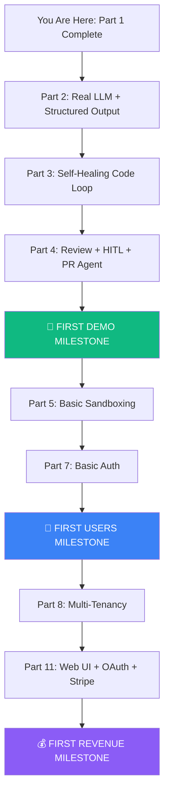

# DevAgents — Comprehensive PRD Analysis & Deep Thoughts

> **Author**: AI Architecture Review | **Date**: August 9, 2026
> **Scope**: Full analysis of [existing PRD specs](file:///Users/prathamesh/My%20Drive%20(arceusgaming13@gmail.com)/DevAgents%20Enterprise%20Architecture/Specifications/01_PRD.md), [architecture docs](file:///Users/prathamesh/My%20Drive%20(arceusgaming13@gmail.com)/DevAgents%20Enterprise%20Architecture/Specifications/02_ARCHITECTURE.md), and the [implemented codebase](file:///Users/prathamesh/devagents)

---

## 🔭 Executive Summary — My Honest Thoughts

DevAgents has a **phenomenal architectural vision** — the enterprise spec documents (01–09) are among the most thorough I've seen for an AI coding platform. The security model (RLS, MicroVM sandbox, hash-chained audit), the agent flow design, and the distribution strategy are genuinely enterprise-grade.

**However, there's a critical tension:** The architecture documents describe a **13-part, 69-story enterprise fortress**, but your stated goal is that the product needs to be **"very easy to use, not much complexity."** These two goals are in direct conflict as currently designed. Below is my deep analysis of this tension and everything you need to handle correctly.

---

## 1. Current State Assessment — What's Built vs What's Planned

### ✅ What's Actually Implemented (Part 1 — ~60% complete)

| Component | Status | Files |
|-----------|--------|-------|
| Monorepo scaffolding | ✅ Done | [docker-compose.yml](file:///Users/prathamesh/devagents/docker-compose.yml) |
| PostgreSQL + Redis infra | ✅ Done | Docker services with health checks |
| Alembic migration tooling | ✅ Done | [alembic.ini](file:///Users/prathamesh/devagents/alembic.ini) |
| `Task` + `LLMCall` DB models | ✅ Done | [models.py](file:///Users/prathamesh/devagents/shared/db/models.py) |
| `DevAgentState` TypedDict | ✅ Done | [state.py](file:///Users/prathamesh/devagents/shared/graph/state.py) — but **minimal** (6 fields vs 25+ in spec) |
| LangGraph 3-node graph | ✅ Done | [workflow.py](file:///Users/prathamesh/devagents/shared/graph/workflow.py) — `planner → human_review → coder` |
| Multi-provider LLM client | ✅ Done | [providers.py](file:///Users/prathamesh/devagents/shared/llm/providers.py) — Gemini, OpenAI, Anthropic, Ollama, Stub |
| Token budget circuit breaker | ✅ Done | [circuit_breaker.py](file:///Users/prathamesh/devagents/shared/graph/circuit_breaker.py) |
| FastAPI `POST /tasks` + `GET /tasks/{id}` | ✅ Done | [tasks.py](file:///Users/prathamesh/devagents/services/api/routes/tasks.py) |
| Celery worker + graph dispatch | ✅ Done | [celery_app.py](file:///Users/prathamesh/devagents/services/worker/celery_app.py) |
| CLI (`cli.py`) | ✅ Done | [cli.py](file:///Users/prathamesh/devagents/cli.py) |
| React + Vite + Tailwind frontend | ✅ Done | [App.jsx](file:///Users/prathamesh/devagents/services/frontend/src/App.jsx) |

### 🔴 What's NOT Built Yet (Parts 2–13 — ~90% of the spec)

| Missing Component | Spec Reference | Impact |
|-------------------|----------------|--------|
| **Real LLM integration in graph** | Part 2 | Planner works, but no structured plan parsing with real output validation |
| **Sandbox Runner** | Part 3 + Part 5 | `services/sandbox-runner/` exists but is empty — code runs unsandboxed |
| **Review/Security/Doc agents** | Part 4 | Only 3 graph nodes exist; spec calls for 8+ |
| **HITL gate (real interrupt)** | Part 4, FR-6 | Current `human_review` node is a passthrough, not a real `interrupt_before` |
| **Firecracker/gVisor MicroVM** | Part 5 | Zero sandbox isolation — biggest security gap |
| **OpenTelemetry + Langfuse** | Part 6 | No tracing instrumentation |
| **Hash-chained audit log** | Part 6 | No `audit_log` table exists |
| **Auth/RBAC/Keycloak** | Part 7 | API is completely unauthenticated |
| **Multi-tenancy (RLS)** | Part 8 | `tenant_id` columns exist but RLS policies not applied |
| **Guardrails/NeMo** | Part 9 | No prompt injection defense |
| **K8s/Helm deployment** | Part 10 | Only Docker Compose exists |
| **SSO/OAuth** | Part 11 | No authentication UI |
| **Stripe billing** | Part 11 | No payment integration |
| **WebSocket streaming** | Part 12 | No real-time updates |
| **AST graph/Tree-Sitter** | Part 12 | Not implemented |

---

## 2. 🧠 Deep Architecture Thoughts — The Good, The Concerning, The Missing

### 2.1 What's Architecturally Excellent ✅

**1. The Agent State Machine is correctly designed**
The [agent flows spec](file:///Users/prathamesh/My%20Drive%20(arceusgaming13@gmail.com)/DevAgents%20Enterprise%20Architecture/Specifications/03_AGENT_FLOWS.md) is one of the best multi-agent state machine designs I've reviewed:
- Router-level budget enforcement (not prompt-level) — this is the correct approach
- Pre/post conditions on every node (§4.1–4.8) — testable contracts
- Bounded retry loops with deterministic exit conditions
- HITL gate implemented as `interrupt_before` (genuine pause, not a question)

**2. The security model has genuine defense-in-depth**
The [security spec](file:///Users/prathamesh/My%20Drive%20(arceusgaming13@gmail.com)/DevAgents%20Enterprise%20Architecture/Specifications/06_SECURITY_COMPLIANCE.md) covers threats that 99% of AI coding platforms ignore:
- Cloud metadata SSRF blocking (169.254.169.254)
- Hash-chained tamper-evident audit trail
- Secret redaction *before* LLM context (not after)
- Negative cross-tenant tests as CI gate

**3. The LLM provider abstraction is well-implemented**
[providers.py](file:///Users/prathamesh/devagents/shared/llm/providers.py) already supports 5 providers with graceful fallback to stub — this is production-quality provider abstraction for day 1.

**4. Zero vendor lock-in is genuine**
Every component in the [free stack BOM](file:///Users/prathamesh/My%20Drive%20(arceusgaming13@gmail.com)/DevAgents%20Enterprise%20Architecture/Specifications/07_FREE_STACK_DEPLOYMENT.md) is actually $0 license. This isn't marketing — the architecture genuinely avoids paid dependencies.

---

### 2.2 What's Architecturally Concerning ⚠️

> [!WARNING]
> These are not bugs — they are architectural design decisions that need explicit attention.

#### Concern 1: Over-Engineering vs "Easy to Use"

The spec describes **30 functional requirements**, **21 zero-flaw design principles**, and **13 implementation parts with 69 stories**. This is an enterprise fortress, but the user said the product should be **"very easy to use, not much complexity."**

**The problem**: If you build everything in the spec, the product will have:
- 15+ Docker containers to run locally
- Keycloak SSO setup (complex)
- Firecracker MicroVM setup (requires `/dev/kvm` + Linux host)
- Qdrant + MinIO + Prometheus + Grafana + Loki + Tempo + Langfuse
- PostgreSQL RLS policy management
- Helm chart configuration

**This is not "easy to use."** A developer wanting to try DevAgents would need to:
1. Clone the repo
2. Configure 10+ environment variables
3. Have Docker with 8+ GB RAM
4. Wait 5+ minutes for first boot
5. Understand LangGraph concepts to debug issues

> [!IMPORTANT]
> **Recommendation**: Create a **"Zero-Config Mode"** that works with `docker compose up` and nothing else. All enterprise features (RLS, Keycloak, Firecracker, Qdrant, etc.) should be **opt-in overlays**, not required defaults.

#### Concern 2: The `DevAgentState` Gap

The spec ([03_AGENT_FLOWS.md §3](file:///Users/prathamesh/My%20Drive%20(arceusgaming13@gmail.com)/DevAgents%20Enterprise%20Architecture/Specifications/03_AGENT_FLOWS.md)) defines **25+ fields** in `DevAgentState`. The implementation in [state.py](file:///Users/prathamesh/devagents/shared/graph/state.py) has **6 fields**:

```diff
# What the spec says (25+ fields):
  tenant_id, project_id, task_id, requested_by_user_id,
  task_prompt, source, implementation_plan, acceptance_criteria,
  generated_code, diff_summary, retry_count, max_retries,
  last_traceback, sandbox_id, test_results, execution_time_ms,
  review_status, security_findings, secrets_detected,
  changelog, hitl_status, approved_by_user_id, human_feedback,
  tokens_used, token_budget, cost_usd_estimate,
  pr_url, final_status, trace_id

# What's implemented (6 fields):
- task_id, prompt, status, implementation_plan, logs, tokens_used
```

This means the **entire self-healing loop, sandbox execution, review pipeline, and HITL gate** can't work yet because the state doesn't carry the required data.

#### Concern 3: The Checkpoint Implementation is Manual

The [celery worker](file:///Users/prathamesh/devagents/services/worker/celery_app.py) manually inserts checkpoint rows via raw SQL:
```python
checkpoint_sql = text("""
    INSERT INTO checkpoints (id, task_id, checkpoint_seq, node_name, state_json, created_at)
    VALUES (:id, :task_id, :checkpoint_seq, :node_name, :state_json, NOW())
""")
```

But LangGraph has a built-in `PostgresSaver` checkpointer that handles this automatically. The spec (02_ARCHITECTURE.md §L2) says "Checkpointer: Postgres (durable)" — this should be using `langgraph.checkpoint.postgres.PostgresSaver`, not manual SQL inserts. The manual approach will break when you add real `interrupt_before` for HITL.

#### Concern 4: No Test Infrastructure

There's a `tests/` directory but no test files were found. For a platform that claims "zero architectural flaws," the absence of any automated tests is concerning. The [Agents.md](file:///Users/prathamesh/devagents/Agents.md) §9 requires running unit tests, integration tests, linting, and type checking — but none of these exist yet.

#### Concern 5: Frontend Polls Every 3 Seconds

[App.jsx](file:///Users/prathamesh/devagents/services/frontend/src/App.jsx) line 37:
```javascript
const interval = setInterval(fetchTasks, 3000);
```

The spec (FR-22, 02_ARCHITECTURE.md §14) calls for **WebSocket streaming** (`ws://api/tasks/{id}/stream`). Polling every 3 seconds is a temporary solution, but at scale with 100+ concurrent users, this becomes 33+ requests/second to the API for just status polling.

---

### 2.3 What's Missing From the Specs ❌

These are things that even the comprehensive spec documents don't adequately address:

#### Missing 1: Repository Connection & Git Integration UX

The spec talks about "ingesting requirements" and "creating PRs" but never describes:
- **How does a user connect their GitHub/GitLab repo?** What's the UI flow?
- **How does the agent clone and read the codebase?** Where is it stored?
- **How does the generated code get applied to the actual repo?** The `generated_code` dict in state is `{filepath: content}`, but there's no git operations layer.

This is the **single biggest UX gap** — the product can plan and generate code, but there's no mechanism to actually write code to a real repository.

#### Missing 2: Project Context & Codebase Understanding

The spec mentions "Hybrid AST + Vector Knowledge Graph" (Part 12) but this is Part 12 of 13 — meaning the product will operate for months without understanding the target codebase structure. Until then:
- The Planner agent has zero knowledge of existing code
- The Coder agent generates code in isolation
- The generated code has no guarantee of fitting the existing project structure

**This is a critical usability gap.** An AI coding tool that doesn't understand your codebase is not "easy to use" — it's guessing.

#### Missing 3: Error Recovery UX

The spec defines `HumanEscalation` as a node in the state machine, but never describes:
- What does the user see when escalation happens?
- How do they provide guidance back to the agent?
- What if the user doesn't respond for hours/days?
- Is there a timeout on HITL gates?

#### Missing 4: Local Development Experience

For a product that should be "easy to use":
- There's no `devagents init` command to set up a project
- There's no `.devagents.yml` project config file
- There's no VS Code extension or IDE integration
- There's no `devagents watch` mode for continuous operation

#### Missing 5: Onboarding & First-Run Experience

The spec has no mention of:
- First-time user onboarding flow
- Sample/demo task to prove the system works
- Health diagnostics (is Postgres up? Is Redis connected? Is the LLM key valid?)
- Guided setup wizard in the Web UI

---

## 3. 📋 Comprehensive PRD — What You Need to Handle Correctly

### 3.1 The "Easy to Use" Product Vision

Based on your requirement for simplicity, here's what the product should feel like:

```
┌─────────────────────────────────────────────────────────────────┐
│                    DevAgents User Experience                     │
│                                                                  │
│  STEP 1: Install                                                 │
│  $ docker compose up        (or: pip install devagents)          │
│                                                                  │
│  STEP 2: Connect Repo                                            │
│  Open http://localhost:3000 → Paste GitHub repo URL → Done       │
│                                                                  │
│  STEP 3: Give Task                                               │
│  "Add input validation to the /signup endpoint"                  │
│                                                                  │
│  STEP 4: Watch It Work (live in Web UI)                          │
│  Planning... → Coding... → Testing... → Reviewing...             │
│                                                                  │
│  STEP 5: Approve PR                                              │
│  Click "Approve & Create PR" → PR appears on GitHub              │
│                                                                  │
│  That's it. 5 steps. Under 5 minutes to first value.             │
└─────────────────────────────────────────────────────────────────┘
```

### 3.2 Feature Tiers — Must-Have vs Nice-to-Have vs Enterprise-Only

> [!IMPORTANT]
> This is the critical decision: not everything in the spec should be built for v1. Here's the tier system.

#### Tier 1: Core Product (Must Ship — "Easy to Use" Version)

| # | Feature | Why It's Critical | Current Status |
|---|---------|-------------------|----------------|
| 1 | **1-command startup** | `docker compose up` and it works | ✅ Mostly works |
| 2 | **Submit task via Web UI** | Primary user interaction | ✅ Basic form exists |
| 3 | **Real LLM planning** | Core value prop — AI creates implementation plan | ✅ Works with Gemini/OpenAI |
| 4 | **Real code generation** | Core value prop — AI writes code | ⚠️ Coder node exists but output isn't structured |
| 5 | **Visible execution progress** | User must see what's happening, not stare at spinner | ⚠️ Polling exists, needs WebSocket |
| 6 | **Task detail inspection** | View plan, generated code, logs | ⚠️ Modal exists but limited data |
| 7 | **Token usage tracking** | User needs to know cost | ✅ `llm_calls` table + token counting |
| 8 | **Health monitoring** | Is the system working? | ✅ `/health` endpoint |
| 9 | **CLI alternative** | Power users want terminal access | ✅ `cli.py` works |
| 10 | **Multi-provider LLM support** | Use Gemini OR OpenAI OR Ollama | ✅ 5 providers implemented |

#### Tier 2: Safety & Quality (Must Ship Before Production Users)

| # | Feature | Why It's Critical | Current Status |
|---|---------|-------------------|----------------|
| 11 | **Sandboxed code execution** | Cannot run AI-generated code on host | 🔴 Not implemented |
| 12 | **Bounded retry loops** | Prevent infinite LLM calls | ⚠️ Circuit breaker exists but no retry loop |
| 13 | **HITL approval gate** | Human must approve before PR | ⚠️ Node exists but doesn't truly interrupt |
| 14 | **Review agent (ruff/eslint)** | Code quality before human sees it | 🔴 Not implemented |
| 15 | **Secret scanning** | Never leak keys to LLM or PR | 🔴 Not implemented |
| 16 | **Basic auth** | Can't be open to the world | 🔴 Not implemented |
| 17 | **Structured code output** | `{filepath: content}` dict must be parseable | ⚠️ JSON parser exists but fragile |
| 18 | **Git operations** | Actually apply code to repos | 🔴 Not implemented |

#### Tier 3: Enterprise (Sell to Companies — Build After Tier 1+2 Work)

| # | Feature | Why It's Critical | Current Status |
|---|---------|-------------------|----------------|
| 19 | Multi-tenancy (RLS) | Sell to multiple companies | 🔴 Schema ready, policies not |
| 20 | SSO/OAuth (Keycloak) | Enterprise login | 🔴 Not implemented |
| 21 | Stripe billing | Revenue | 🔴 Not implemented |
| 22 | Hash-chained audit log | Compliance (SOC2) | 🔴 Not implemented |
| 23 | Firecracker MicroVM | Maximum sandbox security | 🔴 Not implemented |
| 24 | AST symbol graph | Deep code understanding | 🔴 Not implemented |
| 25 | Nightly scanner agent | Autonomous operations | 🔴 Not implemented |
| 26 | WebSocket streaming | Real-time UX | 🔴 Not implemented |
| 27 | Helm chart | Enterprise deployment | 🔴 Not implemented |
| 28 | Multi-provider fallback | High availability | 🔴 Not implemented |
| 29 | Parallel subagents | Performance | 🔴 Not implemented |
| 30 | Ephemeral previews | Review experience | 🔴 Not implemented |

---

### 3.3 Critical Path — What to Build Next (Priority Order)



---

## 4. Things You MUST Handle Correctly

### 4.1 The `DevAgentState` Must Be Complete Before Part 3

The current 6-field state ([state.py](file:///Users/prathamesh/devagents/shared/graph/state.py)) cannot support the self-healing loop. Before building Part 3, you MUST expand it to match the spec:

```python
# MINIMUM viable state for self-healing loop:
class DevAgentState(TypedDict):
    # Identity
    task_id: str
    tenant_id: Optional[str]        # can be None in single-tenant mode
    
    # Task
    task_prompt: str
    source: str
    
    # Planning
    implementation_plan: Optional[str]
    acceptance_criteria: list[str]
    
    # Coding loop (CRITICAL FOR SELF-HEALING)
    generated_code: dict[str, str]   # filepath → content
    retry_count: int                  # MUST track this
    max_retries: int                  # server-enforced ceiling
    last_traceback: Optional[str]     # for scoped self-healing context
    
    # Execution
    test_results: Optional[dict]      # {passed: bool, traceback: str}
    
    # Review
    review_status: str
    security_findings: list[dict]
    
    # Human governance
    hitl_status: str
    human_feedback: Optional[str]
    
    # Budget
    tokens_used: int
    token_budget: int
    
    # Outcome
    final_status: str
    pr_url: Optional[str]
    
    # Operational
    logs: list[str]
    trace_id: Optional[str]
```

### 4.2 Use LangGraph's Built-in Checkpointer

Replace the manual SQL checkpoint in [celery_app.py](file:///Users/prathamesh/devagents/services/worker/celery_app.py) with:

```python
from langgraph.checkpoint.postgres import PostgresSaver

checkpointer = PostgresSaver.from_conn_string(DATABASE_URL)
graph = create_agent_graph(checkpointer=checkpointer)

# LangGraph handles checkpointing automatically
config = {"configurable": {"thread_id": task_id_str}}
final_state = graph.invoke(initial_state, config=config)
```

This is **mandatory** for:
- Real `interrupt_before` HITL gates
- Time-travel / checkpoint listing (`GET /tasks/{id}/checkpoints`)
- Crash recovery (resume from last checkpoint)

### 4.3 Structured Code Output Parsing

The Coder agent currently returns raw text. You need a robust parser that extracts `{filepath: content}` from LLM output. The current [parser.py](file:///Users/prathamesh/devagents/shared/graph/prompts/parser.py) exists but needs to handle:

1. **Markdown code blocks** with filenames: `` ```python:src/auth.py ``
2. **JSON output** when the LLM returns structured JSON
3. **Fallback** when the LLM returns unstructured text
4. **Validation** that file paths don't escape the project directory (security!)

### 4.4 The Sandbox Problem

You have three options for sandbox execution, ordered by complexity:

| Option | Complexity | Security | "Easy to Use"? |
|--------|-----------|----------|----------------|
| **Docker container** (not in spec, but practical) | Low | Medium | ✅ Works everywhere |
| **gVisor** (`runsc` runtime) | Medium | High | ⚠️ Linux only |
| **Firecracker MicroVM** | High | Maximum | ❌ Requires `/dev/kvm`, Linux only |

> [!TIP]
> **Recommendation for "easy to use"**: Start with **Docker container** sandbox for v1 (with `--network=none`, read-only filesystem, resource limits). Add Firecracker as an enterprise option later. This keeps `docker compose up` working on macOS too.

### 4.5 Git Operations Layer

You need a `GitOperations` service that can:

```python
class GitOperations:
    def clone_repo(self, repo_url: str, branch: str) -> str:
        """Clone repo to workspace, return path"""
    
    def read_file(self, path: str) -> str:
        """Read file from cloned repo"""
    
    def list_files(self, path: str) -> list[str]:
        """List all files in repo"""
    
    def apply_changes(self, changes: dict[str, str]) -> None:
        """Apply generated_code dict to repo"""
    
    def create_branch(self, branch_name: str) -> None:
        """Create feature branch"""
    
    def create_pr(self, title: str, body: str, base: str) -> str:
        """Create PR via GitHub API, return URL"""
    
    def get_diff(self) -> str:
        """Get git diff of applied changes"""
```

This doesn't exist anywhere in the codebase or the spec at a code level.

### 4.6 The HITL Gate Must Be a Real Interrupt

Current implementation in [workflow.py](file:///Users/prathamesh/devagents/shared/graph/workflow.py):
```python
# CURRENT: human_review_node is a passthrough
def human_review_node(state: DevAgentState) -> dict:
    plan_approved = state.get("plan_approved", True)  # defaults to True!
```

Required implementation:
```python
# CORRECT: Use interrupt_before for genuine graph pause
graph = workflow.compile(
    checkpointer=checkpointer,
    interrupt_before=["hitl_gate"]  # Graph genuinely pauses here
)
```

When the graph hits `hitl_gate`, it saves state to Postgres and **stops execution**. The user then approves/rejects via the API, and the graph resumes. This requires the LangGraph PostgresSaver checkpointer (§4.2 above).

### 4.7 Error Handling Must Be Graceful

Currently, the worker's error handling is:
```python
except Exception as e:
    task.final_status = "failed"
```

This needs to be much more specific:
- **LLM API timeout**: Retry with exponential backoff, then fall back to another provider
- **LLM rate limit**: Queue and retry after delay
- **Invalid LLM output**: Parse error → retry with clearer prompt
- **Budget exceeded**: Clean abort with clear message to user
- **Database error**: Retry with circuit breaker
- **Sandbox timeout**: Kill and report, don't hang

### 4.8 The Frontend Needs These UX Improvements for "Easy to Use"

| Current | Needed |
|---------|--------|
| Polling every 3s | WebSocket for real-time updates |
| Basic task form | Guided task creation with templates/examples |
| Task cards show minimal info | Show current graph node, progress %, estimated time |
| No onboarding | First-run wizard: "Welcome → Connect Repo → Try a Task" |
| No error messages | User-friendly error displays with suggested fixes |
| No dark/light mode toggle | Already dark, but needs proper theming |
| No keyboard shortcuts | Power users want `Cmd+K` command palette |
| No mobile responsive | Works but not optimized |

### 4.9 Configuration Management

The system needs a clear configuration hierarchy:

```
1. Environment variables (.env)           — infra config (DB, Redis, ports)
2. System config (config.yml)             — system behavior (max_retries, timeouts)
3. Project config (.devagents.yml)        — per-repo settings (language, test command)
4. Task config (API request body)         — per-task overrides (budget, retries)
```

Currently only #1 exists. The others are hardcoded or don't exist.

### 4.10 Monitoring & Diagnostics

For "easy to use," the system must self-diagnose. Add:

```
GET /health/detailed
{
  "status": "degraded",
  "checks": {
    "database": {"status": "ok", "latency_ms": 3},
    "redis": {"status": "ok", "latency_ms": 1},
    "llm_provider": {"status": "error", "error": "GEMINI_API_KEY not set"},
    "worker": {"status": "ok", "active_tasks": 2},
    "disk": {"status": "ok", "free_gb": 45}
  },
  "recommendations": [
    "Set GEMINI_API_KEY in .env to enable real LLM integration"
  ]
}
```

---

## 5. Usability-First Architecture Recommendations

### 5.1 Two-Mode Architecture

Instead of building all 13 parts sequentially, create two modes:

```
┌──────────────────────────────────────────────────────────────┐
│                        DevAgents                              │
│                                                               │
│  ┌─────────────────────┐    ┌─────────────────────────────┐  │
│  │  🟢 Simple Mode      │    │  🔵 Enterprise Mode          │  │
│  │  (Default)           │    │  (Opt-in via config)         │  │
│  │                      │    │                              │  │
│  │  • docker compose up │    │  • Keycloak SSO              │  │
│  │  • SQLite or Postgres│    │  • PostgreSQL RLS            │  │
│  │  • Docker sandbox    │    │  • Firecracker MicroVM       │  │
│  │  • File-based auth   │    │  • Qdrant vector DB          │  │
│  │  • Local LLM (Ollama)│    │  • WORM audit trail          │  │
│  │  • Basic Web UI      │    │  • Stripe billing            │  │
│  │  • CLI               │    │  • Helm K8s deployment       │  │
│  │                      │    │  • Multi-tenant isolation    │  │
│  │  Setup: 2 minutes    │    │  Setup: 30 minutes           │  │
│  └─────────────────────┘    └─────────────────────────────┘  │
└──────────────────────────────────────────────────────────────┘
```

### 5.2 Progressive Complexity

Features should be discoverable but not required:

```yaml
# .env (Simple Mode - all you need)
LLM_PROVIDER=gemini
GEMINI_API_KEY=your-key-here

# That's it. Everything else has sensible defaults.
# To enable enterprise features, add:
# ENABLE_RLS=true
# ENABLE_SSO=true
# KEYCLOAK_URL=http://keycloak:8080
# ENABLE_SANDBOX=firecracker
# etc.
```

### 5.3 The "5-Minute Demo" Test

The product should pass this test:

1. **Minute 0–1**: `git clone` + `docker compose up`
2. **Minute 1–2**: Open `http://localhost:3000`, see the dashboard
3. **Minute 2–3**: Type a task: "Add a function that validates email addresses"
4. **Minute 3–4**: Watch the agent plan and generate code in real-time
5. **Minute 4–5**: See the generated code, approve it

If any step takes longer than 1 minute or requires documentation, the product is too complex.

---

## 6. Risk Register — Things That Can Go Wrong

| Risk | Likelihood | Impact | Mitigation |
|------|-----------|--------|------------|
| **LLM generates malicious code** | Medium | Critical | Sandbox isolation (Tier 2 blocker) |
| **LLM API costs spiral** | High | High | Circuit breaker exists ✅, needs monthly cap |
| **LLM output parsing fails** | High | Medium | Robust parser with fallback + retry |
| **Database migration breaks** | Medium | High | Always test downgrade paths |
| **Docker Compose can't run on user's machine** | Medium | High | Document minimum requirements (8GB RAM) |
| **User's LLM API key is invalid** | High | Medium | Validate on startup, clear error message |
| **Generated code doesn't compile** | High | Medium | Sandbox test loop (self-healing) |
| **HITL gate never gets approved (abandoned task)** | Medium | Low | Auto-timeout after configurable period |
| **Worker crashes mid-execution** | Medium | High | Checkpointer enables resume from last node |
| **Multiple users submit concurrent tasks** | Medium | Medium | Celery handles this, but test under load |

---

## 7. Quality Checklist — Everything to Handle Correctly

### 7.1 Backend Quality Checklist

- [ ] **All API endpoints return proper error codes** (not just 500)
- [ ] **Input validation on all endpoints** (Pydantic models)
- [ ] **Rate limiting** (even basic, before Tier 3)
- [ ] **Request/response logging** with trace IDs
- [ ] **Database connection pooling** configured
- [ ] **Graceful shutdown** (drain Celery queues)
- [ ] **Health check covers all dependencies** (DB, Redis, LLM)
- [ ] **Alembic migrations are reversible** (downgrade works)
- [ ] **Token counting is accurate** (verify against LLM provider)
- [ ] **Circuit breaker tests** (prove budget enforcement works)

### 7.2 Agent Quality Checklist

- [ ] **Planner output is validated** (has acceptance criteria)
- [ ] **Coder output is parsed** (valid filepath→content mapping)
- [ ] **Retry count is bounded** (max 3, configurable)
- [ ] **Traceback context is scoped** (only failing test, not full history)
- [ ] **Budget is checked before every LLM call** (pre-call, not post-call)
- [ ] **State transitions are logged** (for audit trail)
- [ ] **Node functions are pure** (same input → same output → replayable)
- [ ] **Router logic is deterministic** (no LLM in routing decisions)
- [ ] **HITL gate genuinely pauses** (not a passthrough)
- [ ] **Escalation path exists** (when retries exhausted)

### 7.3 Frontend Quality Checklist

- [ ] **Loading states on all actions** (no silent waits)
- [ ] **Error states with actionable messages** (not just "Failed")
- [ ] **Empty states with guidance** (when no tasks exist)
- [ ] **Responsive layout** (works on tablet)
- [ ] **Keyboard accessible** (tab navigation)
- [ ] **Optimistic UI updates** (instant feedback, sync in background)
- [ ] **Connection status indicator** (is API online?)
- [ ] **Task detail shows full execution history**
- [ ] **Generated code is syntax-highlighted**
- [ ] **Diff viewer** for generated changes

### 7.4 DevOps Quality Checklist

- [ ] **Docker Compose starts in under 60 seconds**
- [ ] **`.env.example` is always up to date**
- [ ] **All containers have health checks**
- [ ] **Logs are structured JSON** (parseable)
- [ ] **Volumes persist data across restarts**
- [ ] **Port conflicts are documented** (5433, 6380, 8005, 3000)
- [ ] **Memory limits on all containers** (prevent OOM)
- [ ] **Graceful dependency ordering** (`depends_on` with conditions)

### 7.5 Security Quality Checklist (Minimum for Any Users)

- [ ] **No secrets in code or logs**
- [ ] **CORS is not `*` in production** (currently `allow_origins=["*"]`)
- [ ] **Generated code never runs on host**
- [ ] **LLM context is sanitized** (no API keys forwarded)
- [ ] **File path validation** (prevent directory traversal)
- [ ] **SQL injection protection** (use parameterized queries — ✅ SQLAlchemy handles this)
- [ ] **Input size limits** (prevent 1MB prompts)
- [ ] **Rate limiting** (prevent abuse)

---

## 8. Simplified Implementation Roadmap (Usability-First)

### Phase 1: "It Works" (2–3 weeks)

> Focus: Complete the happy path end-to-end

| Task | Priority | Effort |
|------|----------|--------|
| Expand `DevAgentState` to match spec | P0 | 1 day |
| Switch to LangGraph `PostgresSaver` checkpointer | P0 | 1 day |
| Structured code output parser (robust) | P0 | 2 days |
| Self-healing code loop (retry with traceback) | P0 | 2 days |
| Review agent (ruff/eslint subprocess) | P1 | 1 day |
| Real HITL gate (`interrupt_before`) | P0 | 2 days |
| HITL API endpoints (GET review, POST decision) | P0 | 1 day |
| Frontend: task detail with plan + code viewer | P1 | 2 days |
| Frontend: HITL approval UI | P1 | 1 day |

### Phase 2: "It's Safe" (2–3 weeks)

> Focus: Run AI-generated code safely

| Task | Priority | Effort |
|------|----------|--------|
| Docker container sandbox runner | P0 | 3 days |
| Secret scanning (gitleaks) on generated code | P0 | 1 day |
| Basic auth (API key or JWT) | P0 | 2 days |
| Frontend: auth login page | P1 | 1 day |
| Git operations layer (clone, branch, apply, PR) | P0 | 3 days |
| Detailed health check endpoint | P1 | 1 day |
| First-run onboarding wizard | P1 | 2 days |
| Unit tests for graph nodes | P0 | 2 days |
| Integration tests for API | P0 | 2 days |

### Phase 3: "It's Impressive" (3–4 weeks)

> Focus: Make the product feel premium

| Task | Priority | Effort |
|------|----------|--------|
| WebSocket real-time streaming | P1 | 3 days |
| Frontend: live agent visualizer (graph state) | P1 | 3 days |
| Frontend: git diff viewer with syntax highlighting | P1 | 2 days |
| Nightly scanner agent (per-repo cron) | P1 | 3 days |
| Google/GitHub OAuth | P1 | 2 days |
| Codebase indexing (basic file/function listing) | P1 | 2 days |
| Doc agent (changelog generation) | P2 | 1 day |
| Task templates ("Fix bug", "Add feature", "Add tests") | P2 | 1 day |

### Phase 4: "It's Enterprise" (4–6 weeks)

> Focus: Sell to companies

| Task | Priority | Effort |
|------|----------|--------|
| Multi-tenancy (PostgreSQL RLS) | P1 | 1 week |
| Keycloak SSO integration | P1 | 3 days |
| Stripe subscription billing | P1 | 3 days |
| Hash-chained audit log | P1 | 2 days |
| Firecracker MicroVM sandbox (optional) | P2 | 1 week |
| Tree-Sitter AST symbol graph | P2 | 1 week |
| Helm chart deployment | P2 | 3 days |
| OpenTelemetry + Langfuse | P2 | 3 days |
| Cross-tenant negative tests | P1 | 2 days |
| SOC2 control documentation | P2 | 1 week |

---

## 9. Summary of Key Decisions Needed

> [!IMPORTANT]
> These decisions will shape the entire product direction. They need your explicit choice.

| # | Decision | Options | My Recommendation |
|---|----------|---------|-------------------|
| 1 | **Sandbox technology for v1** | Docker container / gVisor / Firecracker | **Docker container** (works on macOS, simplest) |
| 2 | **Authentication for v1** | None / API key / JWT / Full Keycloak | **Simple JWT** (issue tokens manually, add Keycloak later) |
| 3 | **Database for Simple Mode** | PostgreSQL only / SQLite option | **PostgreSQL only** (already in Docker Compose, simpler to maintain one path) |
| 4 | **Checkpointer** | Manual SQL / LangGraph PostgresSaver | **PostgresSaver** (mandatory for HITL and time-travel) |
| 5 | **Frontend updates** | Polling / WebSocket / SSE | **WebSocket** in Phase 3, polling is fine for Phase 1 |
| 6 | **Git integration for v1** | GitHub only / GitHub + GitLab / CLI only | **GitHub only** (focus, add others later) |
| 7 | **LLM default provider** | Gemini / OpenAI / Ollama | **Gemini** (free tier, already implemented) with Ollama as fallback |
| 8 | **Multi-tenancy timing** | Build now / Build in Phase 4 | **Phase 4** (single-tenant first, prove the product works) |

---

> [!NOTE]
> This PRD analysis is based on reading all 9 spec documents, all implemented source files, and the project's Docker/infrastructure configuration. The recommendations prioritize your stated goal of **"easy to use, not much complexity"** while preserving the excellent enterprise architecture for later phases.
